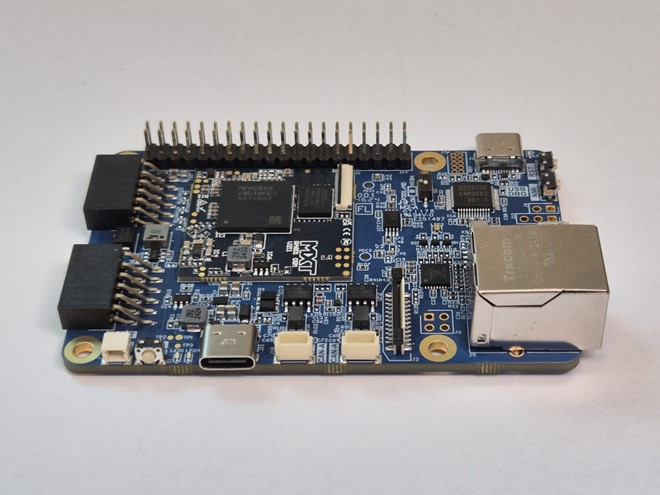
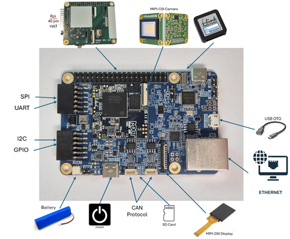

RA8D1 SOM + Carrier Board

Introduction

The RA8D1 SOM EVK is a compact, high-performance embedded computing platform developed around the Renesas RA8D1 microcontroller. It is designed for developers and engineers seeking a balance of performance, security, and rich interface support. This guide outlines the hardware features, setup, and operational overview of the RA8D1 SOM EVK, enabling quick and efficient development of embedded systems.

Overview

This section provides a brief summary of the RA8D1 SOM + Carrier board’s core hardware specifications and functional capabilities.

The RA8D1 SOM + Carrier board features the Renesas RA8D1 microcontroller, powered by a 480 MHz Arm Cortex-M85 core supporting the latest Arm Helium technology designed specifically for DSP and Machine Learning workloads. The board includes up to 2MB dual-bank code flash, 1MB SRAM, advanced graphics controllers (GLCDC and DRW), integrated secure elements, and an extensive range of digital and analog interfaces.

Key Highlights

🚀 High-Speed Processing: Cortex-M85 core with Arm Helium technology.

🎨 Advanced HMI: Support for MIPI-DSI interface and integrated 2D drawing engine.

🔒 Embedded Security: Features secure boot and Arm TrustZone technology.

🔋 Power Efficiency: Battery-backed Real-Time Clock (RTC) and multiple power-saving modes.

📡 Extensive Connectivity:

USB High-Speed/Full-Speed

Ethernet

CAN FD

SDHI

SPI

I²C

Rpi HAT

